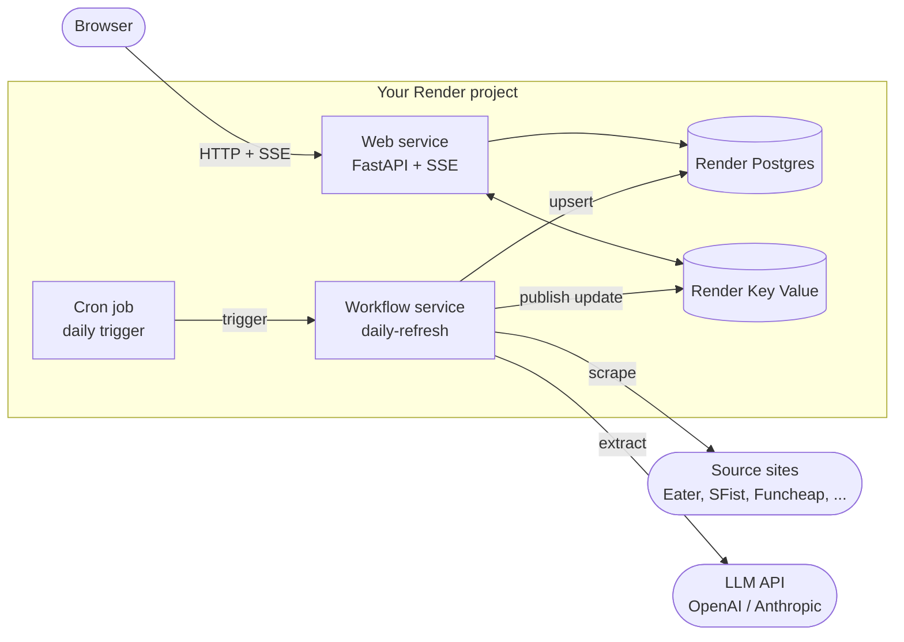
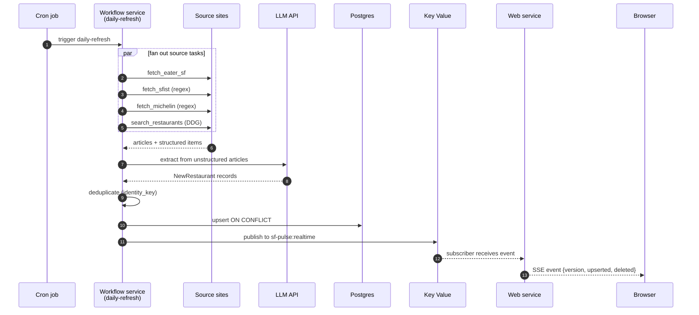

# Architecture

## Overview

SF Pulse is split across three Render service types and two managed datastores. Each piece exists because it solves a specific problem that comes with running a durable agent in production.

## Why each component exists

### Web service (FastAPI)

Serves the HTML home page (Jinja2 templates), the JSON API at `/api/*`, the SSE stream at `/api/events-stream`, and the static React diagram at `/diagram/`. It's a long-lived HTTP process that does no scraping or LLM work itself. All it does is read from Postgres, push realtime updates from Key Value to connected browsers, and accept push subscription registrations.

Splitting reads (web) from writes (workflow) means a slow source fetch never blocks a page load, and a redeploy of the workflow service doesn't drop SSE connections.

### Workflow service (Render Workflows)

Runs the durable task code in `workflow/main.py`. This is the "agent" in the workshop. Each scraping source, the LLM extraction step, and the database persistence step are separate tasks. The orchestrator (`daily-refresh`) fans them out with `asyncio.gather`, tolerates per-source failures, and applies whatever results succeeded.

We use Render Workflows here instead of putting the same logic in the web service or a background worker because:

- Tasks get **per-task retries** without rerunning the whole pipeline.
- Each task run has its own logs and timing, so you can see exactly which source failed.
- **Subtask fan-out** lets the orchestrator parallelize source fetches without re-implementing concurrency, backoff, or partial-failure handling.
- The runtime is **durable**, so a task that crashes mid-batch can resume from where it left off.
- The workflow service can be **redeployed independently** from the user-facing web service.

The workshop's job is to extend this service with new source tasks for SF events.

### Cron job

A single-purpose service whose entire role is to call the workflow service on a schedule. The entrypoint (`bin/trigger_workflow.py`) uses the Render Python SDK to start `daily-refresh` by slug, polls it until completion, then exits.

We use a Render cron job instead of an in-process scheduler (like APScheduler) because:

- The web service should never sleep. A cron-in-app pattern wastes a long-running instance to wait for a once-a-day tick.
- Render cron runs at the platform level, so it survives web service restarts and scaling events.
- The cron service is **stateless** and **disposable**: it boots, calls one workflow task, and exits.

### Render Postgres (database)

The source of truth for everything the agent discovers. Restaurants, events (after step 8 of the workshop), data update logs, and push subscriptions all live here.

We use Postgres rather than:

- A flat JSON or SQLite file, because the workflow service and the web service are separate processes that need concurrent access to the same data.
- An object store like S3, because we need **ACID upserts** on `identity_key` and `dedupe_key` to deduplicate discoveries across runs.
- A NoSQL store, because the data is relational (subscriptions reference preferences, events have categories, restaurants have neighborhoods) and we want SQL filtering on the API.

The schema lives in plain SQL migrations under `migrations/`. Each migration runs in a single transaction and is idempotent.

### Render Key Value (Valkey)

A small Redis-compatible cache used purely as a **pub/sub fanout channel** for SSE. When the workflow service finishes a `daily-refresh` run, `app.sse.broadcast(...)` publishes a message to the `sf-pulse:realtime` channel. Every web service instance subscribes to that channel and forwards the message to its connected browsers.

We need Key Value as soon as the web service scales beyond one instance. Without it:

- Instance A receives an SSE subscription from a browser.
- Instance B runs the workflow's broadcast call (or proxies it).
- Instance A never hears about the broadcast, so the browser never sees the update.

Key Value solves this without us reinventing pub/sub on top of the database. When `REDIS_URL` is unset locally, `app.sse` falls back to an in-process queue so single-instance development still works.

### External LLM API (OpenAI or Anthropic)

The LLM is **one stage** in the workflow, not the whole agent. Source scrapers fetch HTML and produce one of two shapes: structured `NewRestaurant` records (regex sources like SFist and Michelin) or unstructured `RawArticle` blobs (Eater SF, DuckDuckGo search results, Funcheap).

The LLM extraction stage takes the unstructured blobs and produces structured records using a constrained response schema. This is the only place in the pipeline where we accept LLM output, and it's bounded by:

- A Pydantic schema (`response_format` for OpenAI, tool-use for Anthropic) so we can't accept malformed output.
- Batched input (~12K characters per call) to keep prompt costs predictable.
- A regex fallback path that produces results even when `LLM_API_KEY` isn't set.

The factory in `app.llm` auto-detects the provider from the API key prefix (`sk-ant-` → Anthropic, else OpenAI) unless `LLM_PROVIDER` overrides it.

## Daily-refresh data flow

1. The cron job fires at 7am PT and calls `daily-refresh` on the workflow service.
2. `daily-refresh` runs every source-fetch task in parallel: `fetch_eater_sf`, `fetch_sfist`, `fetch_michelin`, `search_restaurants` (DuckDuckGo).
3. Articles from non-regex sources flow into the LLM extraction stage. Regex sources skip extraction entirely.
4. All produced `NewRestaurant` records funnel into `apply_discovered_items`:
   - Deduplicate against existing rows using `identity_key`.
   - Upsert into Postgres with `ON CONFLICT (identity_key) DO UPDATE`.
   - Broadcast an SSE event with `{version, upserted, deleted, summary}` to the `sf-pulse:realtime` channel.
   - Fan out web push notifications to subscribers whose preferences match the new items.
5. The web service picks up the SSE broadcast and forwards it to connected browsers, which soft-reload the home page after a short debounce.

## Source modules

Each scraper in `app.sources` produces either `list[NewRestaurant]` directly (regex sources: SFist, Michelin) or `list[RawArticle]` for the LLM pipeline to extract from (Eater SF, DuckDuckGo).

Adding a new source in the workshop follows the same pattern: write a fetcher in `app/sources/`, wrap it in a workflow task under `workflow/tasks/`, register it in the `daily-refresh` orchestrator's fan-out list.

## LLM extraction

`app.llm.pipeline.extract_restaurants_from_articles` batches articles into ~12K-character chunks, sends each batch to the configured provider (OpenAI via `chat.completions.parse` with a Pydantic `response_format`, or Anthropic via tool-use), and merges results.

If `LLM_API_KEY` is not configured, the factory returns `None` and the pipeline emits an empty list. Callers continue with regex-only sources.

## Deduplication

- **Restaurants**: `identity_key = lower(name) | (lower(address) || lower(neighborhood))`. `ON CONFLICT (identity_key) DO UPDATE` covers the common case.
- `app.refresh` also has fuzzier matching strategies for near-miss duplicates (address normalization, source-URL match) before falling back to identity-key match.

## Realtime SSE

- `app.sse.broadcast(event, data)` publishes to Key Value (`sf-pulse:realtime` channel) when `REDIS_URL` is set, falling back to in-process fan-out otherwise.
- The `/api/events-stream` endpoint creates a per-client async queue. Heartbeats every 25 seconds.
- The browser receives `restaurants` events with `{version, upserted, deleted, summary}` payloads. The current `static/home.js` does a soft reload after a brief debounce. A future enhancement could splice rows in place.

## Push notifications

- VAPID keys live in `VAPID_PUBLIC_KEY` and `VAPID_PRIVATE_KEY`. If unset, the push fan-out is silently skipped.
- After `apply_discovered_items` finishes, only subscribers whose preferences match the new items receive a push (`restaurant_matches_push_preferences`).
- Push provider endpoints are restricted to a trusted hostname allowlist (`is_trusted_push_endpoint`).
